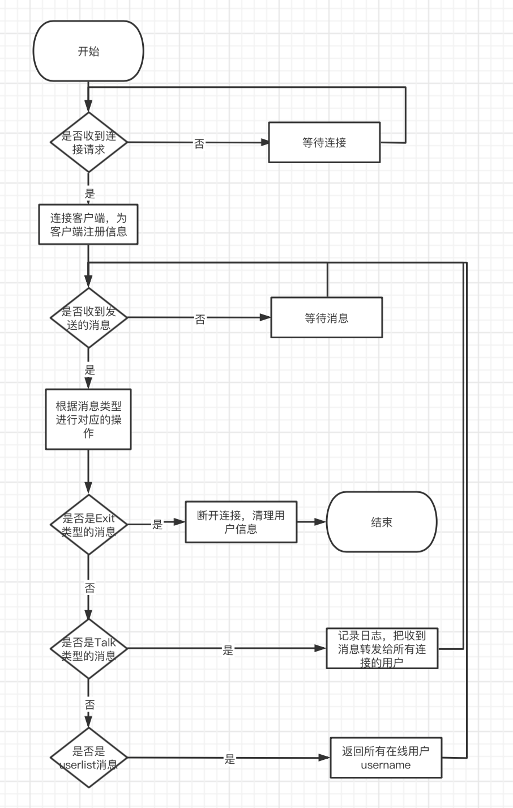

#Websocket + protobuf 实现聊天服务

#整体框架
```
开发一个在线聊天服务，聊天协议websocket，通信数据格式protobuf。
```

#目录结构
```
├── README.md               #介绍
├── go.mod
├── handle                  #处理router的请求
│   └── handle.go
├── log                     #日志文件
│   └── info.log
├── main.go                 #代码入口
├── module                  #数据模型
│   ├── client.go
│   ├── const.go
│   └── hub.go
├   └── protobuf                        
│     ├── com.pb.go
│     └── com.proto
├── router                  #路由
│   └── router.go
├── preTest                  #压力测试
    ├── report.html          #压力测试报告
    ├── websocket_t.py       #压力测试代码

```

#代码逻辑分层
| 层     | 文件夹|主要职责 |调用关系|
| :----: | :----|:---- | :-----|
|router  | /router|路由转发 |调用handle|
|handle  | /handle|处理路由 |调用module|
|module  | /module|数据模型 |被handle调用|

#存储设计
##Hub
| 内容 | 类型 |  说明 |
| :----:| :---- | :---- |
|Clients |map[*Client]bool |保存所有已连接用户的信息|
|Lock |*sync.Mutex|map锁|
|broadcast  |chan []byte|广播|
|Register   |chan *Client|用户注册|
|unregister |chan *Client|用户注销|

##Client
| 内容 | 类型 |  说明 |
| :----:| :---- | :----|
|Username|string|保存用户名字|
|Hub |*Hub|用于获取hub|
|Conn |*websocket.Conn|与客户端连接|
|Send |chan []byte|发送信息|

#运行方式

```
代码运行方式 go run main.go
```

#使用方法
```
运行后，服务器接受客户端发来的请求，服务端进行对应的回复。
测试代码运行后，可在终端中键入信息，按回车进行发送，返回对应的结果。
```

#第三方库
```
google.golang.org/protobuf      通信数据的传输格式 protobuf
github.com/gorilla/websocket    服务器
```

#流程图


